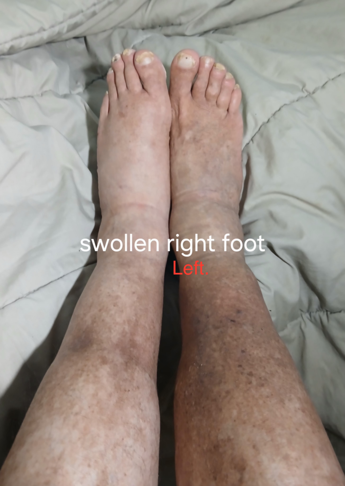
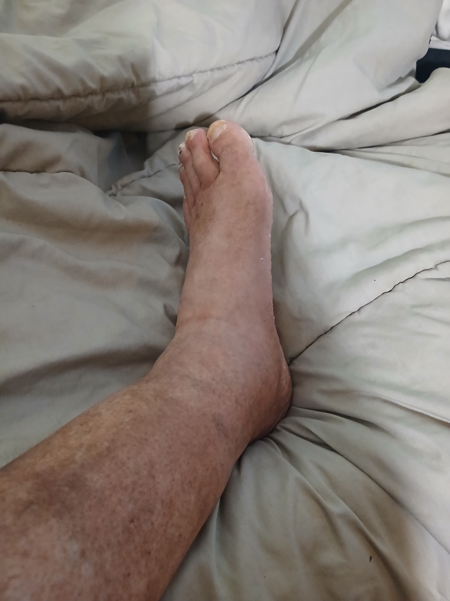
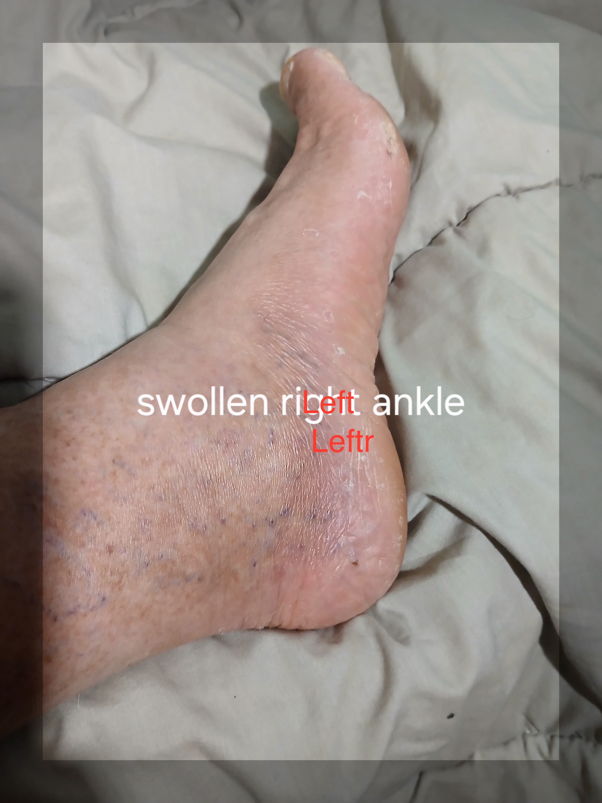
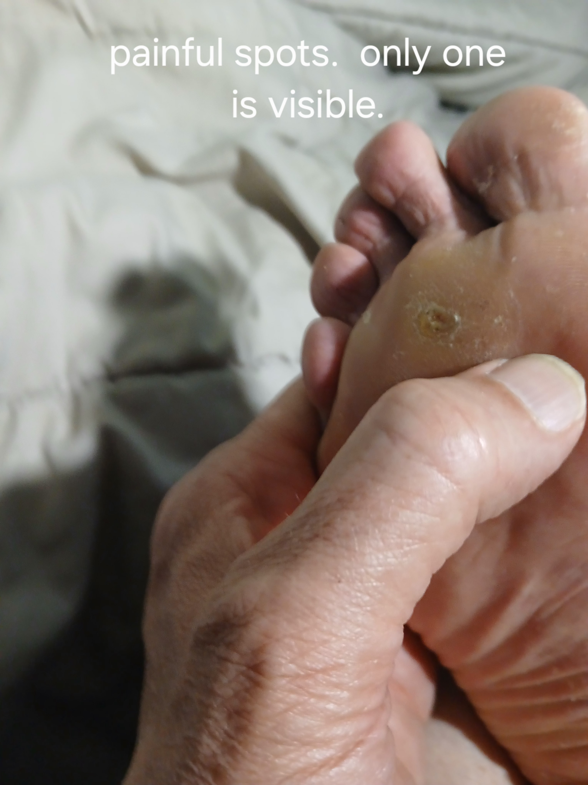

```{css sidenote, echo = FALSE}

.main-container {
    margin-left: 250px;
}
.sidenote, .marginnote { 
  float: right;
  clear: right;
  margin-right: -40%;
  width: 37%;         # best between 50% and 60%
  margin-top: 0;
  margin-bottom: 0;
  font-size: 1.1rem;
  line-height: 1.3;
  vertical-align: baseline;
  position: relative;
  }
```


<style>
@import url('https://fonts.googleapis.com/css?family=Raleway');
@import url('https://fonts.googleapis.com/css?family=Oxygen');
@import url('https://fonts.googleapis.com/css?family=Raleway:bold');
@import url('https://fonts.googleapis.com/css?family=Oxygen:bold');

.main-container {
  max-width: 1400px !important;
}

body{
  font-family: 'Oxygen', sans-serif;
  font-size: 16px;
  line-height: 24px;
}

h1,h2,h3,h4 {
  font-family: 'Raleway', sans-serif;
}

.container { width: 1400px; }

caption {
  font-size: 20px;
  caption-side: top;
  text-indent: 30px;
  background-color: lightgrey;
  color: black;
  margin-top: 5px;
}

g-table-intro h4 {
  text-indent: 0px;
}
</style>

```{r setup, include = FALSE}
knitr::opts_chunk$set(echo = TRUE,
                      comment = NA,
                      warning = FALSE,
                      error = FALSE,
                      message = FALSE,
                      cache = FALSE,
                      fig.width = 8,
                      fig.height = 4)
```

```{r infex-GlobalOptions, results="hide", include=FALSE, cache=FALSE}

knitr::opts_knit$set(stop_on_error = 2L) #really make it stop
options(knitr.table.format = 'html')

options(stringsAsFactors=F)

 #knitr::dep_auto()

```
<!-- ######################################################################## -->


```{r index-Prelims,  include=FALSE, echo=FALSE, results='hide', message=FALSE} 


FN <- "index"
if(sum(grepl(FN, list.files()))==0) stop("Check FN")

PREFIX <- "index" #- replace by FLOWCELL???

 suppressMessages(require(rmarkdown))
 suppressMessages(require(knitr))

 suppressPackageStartupMessages(require(methods))
 suppressPackageStartupMessages(require(bookdown))

 suppressPackageStartupMessages(require(magrittr))

 # Shotcuts for knitting and rendering while in R session (Invoke interactive R from R/Scripts folder)
 kk <- function(n='') knitr::knit2html(paste("t", n, sep=''), envir=globalenv(),
       output=paste(FN,".html", sep=''))

 rr <- function(n='') rmarkdown::render(paste("t", n, sep=''), envir=globalenv(),
       output_file=paste(FN,".html", sep='')) ##, output_dir='Scripts')

 bb <- function(n='') browseURL(paste(FN,".html", sep=''))

 # The usual shortcuts
 zz <- function(n='') source(paste("t", n, sep=''))


```
<!-- ######################################################################## -->

<br/>


<!--
* Breiman: [@Breiman:1984aa; @Breiman:2001aa]
* Freedman: [@Freedman:2008aa; @Freedman:2008ad; @Freedman:2008ac; @Freedman:2009ac]
-->


I use `claude.ai` to compile information on current personal health
and other issues. 

<br/>

# Health: Poor Lower Leg Circulation {.tabset -}

## Reports {-}

* [lower_leg_circulation_report](lower_leg_circulation/reports/lower_leg_circulation_report.html) -
makes the connection between symptoms and potential causal apathies
   - [swim_report](lower_leg_circulation/reports/swim_report.html)


<p><p/>
* [vitamin_b12_report](lower_leg_circulation/reports/vitamin_b12_report.html)  -
detailed report on the connection between vitamin B12 and the apathies being
discussed.
   - ways to supplement the natural supply of vitamin B12 are discussed

<p><p/>
* [venous_insufficiency_treatment](lower_leg_circulation/reports/venous_insufficiency_treatment.html) -
   -  treatments for venous insufficiency

<br/>

## Tracking {-}

<p><p/>
* [symptom_tracker](lower_leg_circulation/tracking/symptom_tracker.html) -
needs formating work

* [self_care_checklist](lower_leg_circulation/tracking/self_care_checklist.html) 

<br/>

## Images {- .tabset}

### Home {-}

<!--

 https://stackoverflow.com/questions/25166624/insert-picture-table-in-r-markdown

- BANG[unchanged image](foo.jpg)

- BANG[much-smaller image](foo.jpg){#id .class width=30 height=20px}

- BANG[half-size image](foo.jpg){#id .class width=50% height=50%}

The dimensions can be provided with no units (pixels assumed), 
or with "px, cm, mm, in, inch and %" 

ref: https://pandoc.org/MANUAL.html, search for link_attributes.

-->


### Lower legs/Feet {-}

{width=25% height=25%}

<br/>

### Left lower leg {-}

{width=25% height=25%}

<br/>

### Left ankle {-}

{width=25% height=25%}


<br/>

### Sore spots {-}

{width=25% height=25%}


<br/>


# Health:  male hernias {-}

<!--
## Reports {-}
-->

* [hernia_report](hernias/reports/hernia_report_html.html) -
gives a summary of incidence and coincidence rates of make hernias


<br/>

```{r, echo=FALSE}
  knitr::knit_exit()
```

##########################################
# ARCHIVAL
##########################################

# Home  Economics

##  Car Finances

* [tesla-complete-guide](car_financing/reports/tesla-guide-complete-markdown.html) -
detailed buying guide comparing aquisition options for teslas

* Divided into two parts:
   -  [Part 1: Financial and Purchase Considerations](car_financing/reports/tesla-guide-part1.html) 
   -  [Part 2: Model and Technical Comparisons](car_financing/reports/tesla-guide-part2-fixed.html) 
      - [Corrected AWD vs RWD Comparison + 2025 vs 2022](car_financing/reports/tesla-comparison-updated-html.html)


<br/>

## The cost of collision insurance


* The elements of an insurance claim are:
   - P the premium, integrated over billing peruis if 6 noths
   - C the cost of repair
   - r = c(r_1, r_2, ...) the risk


